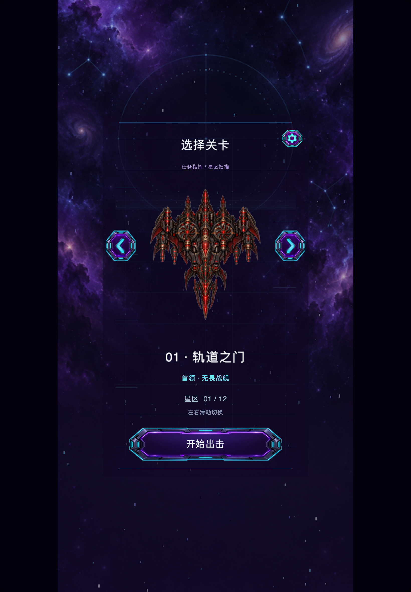

# Sky Strike — iPad Air 4 安装验证

2026-09-24：面向 USB 连接的 iPad Air（第 4 代）重新构建、签名、安装并成功启动。

- TARGETED_DEVICE_FAMILY 从 iPhone 改为 iPhone + iPad；保持原有竖屏、全屏与 1:2 居中留边策略。
- 类型检查、9 项原生测试、Xcode 构建与 codesign 严格校验通过。
- 实机 WebGPU 1640×2360，逻辑画布 820×1180；启动日志达到 scene-ready/present，游戏 phase=ready，无启动或 GPU 错误。
- 检查第 120 帧截图：关卡选择、Boss 分件、文字及按钮显示完整，两侧留边符合比例要求。此轮验证覆盖安装和启动，未做完整战斗操作或性能验收。
- 验证后已关闭帧捕获和性能采集，普通模式启动成功。

