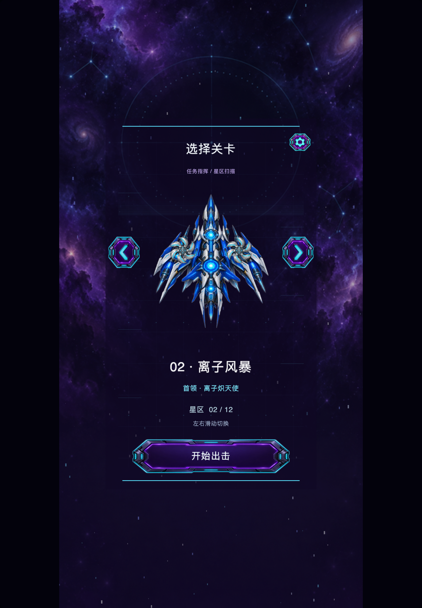

# Sky Strike 统一开屏页接入

2026-09-24，已更新到 iPad Air 4。

直接复用 Native/bridge/branding/NativeEngineLaunchPage 与共享月牙素材，移除原来的 main-page.xml 文字加载页。游戏真正呈现首帧后触发共享组件 180 ms 淡出；初始化错误保留提示。加载文字沿用游戏语言设置。保留 Sky Strike 全画布及 GPU HUD 的安全区处理、竖屏与宽屏 1:2 留边。

类型检查和 10 项测试通过。新增测试覆盖页面创建、首帧接线、错误提示、后台卸载保护及销毁清理。构建、签名、安装和普通启动成功。

真机日志：首帧 splash=leaving，第 120 帧及后续 splash=hidden、game.phase=ready，未出现启动/GPU错误。共享 logo 与包内 logo SHA-256 完全一致。实机画布仍为 1640×2360，关卡选择画面完整。截图为开屏消失后的 GPU 画面，不包含原生开屏遮罩；原生遮罩状态由日志验证。诊断截图随后已关闭。

