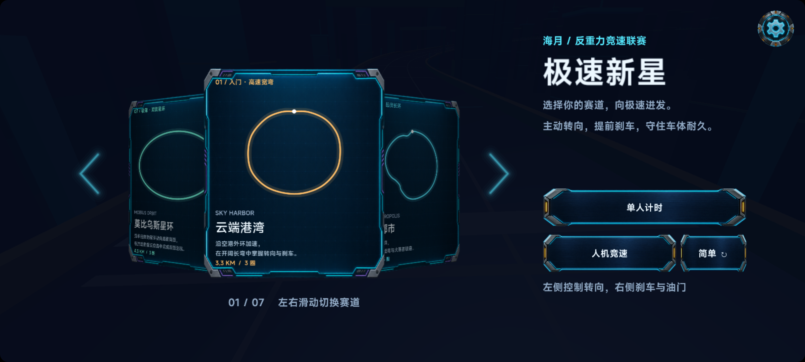

# 0.1.0-rc.2：空表面纹理恢复

日期：2026-09-24。候选 SHA-256：`051d76a3f7d3589c973650fe044ba393dc85f2fd05229280b6aa56aefa0e1705`。保留 rc.1 的原始候选清单与报告于相邻 rc.1 目录。

## 故障依据与处理

[旧宿主日志](before-host.jsonl) 记录游戏已呈现 16,269 帧后发生 `Native surface returned an empty current texture`，随后销毁场景与输入。它证明现有代码将一次取帧失败当成致命错误；日志无法进一步确定底层 Vulkan 返回空纹理的具体原因。

宿主现在在场景更新前获取并缓存本帧纹理。空纹理使用独立错误类型，停止帧循环并以 50–400 ms 退避重配表面，最多重试 8 次；恢复使用新帧时间起点，保留游戏实例。比赛沿用安全暂停行为，恢复后可继续。普通 GPU 校验错误、设备丢失和重试耗尽仍失败清理。表面销毁/重建、零尺寸布局和前后台状态共同控制暂停，退出时清理重试与监听。

## 验证

| 检查 | 结果 |
| --- | --- |
| [完整源码 gate](source.json) | 六个示例类型与依赖检查通过，77 项应用测试 + 7 项发布工具测试通过 |
| [Android 构建 gate](android-build.json) | 通过；与已安装、验收的 APK 哈希一致 |
| [iOS prepare gate](ios-bundle.json) | 通过；不是 iOS 真机验收 |
| [X4000 真机验收](android-verification.json) | 29 项通过：连续 3 次空纹理注入后恢复同一场景、无错误遮罩、表面销毁/重建、驾驶/陀螺仪/音频/震动/赛道切换 |
| [真实前后台切换](android-lifecycle.json) | 5 轮通过；恢复时帧数依次为 22、106、222、338、455；没有致命错误 |

[故障注入日志](verification-host.jsonl) 记录连续 3 次 `surface-wait`，然后 `surface-recovered`（恢复帧为第 5 帧）。注入仅在显式 `NEON_VERIFY_ANDROID` 下执行。测试期间曾因手机熄屏而不满足横屏前提；唤醒后重新完成全部验收。最后恢复正常启动，不带故障注入参数；存档保持不变。

APK SHA-256：`8a9310cda77a9b8471b97ab291ad015134d2bda2ce5b7c3731c9c40cd4dccc93`。

本地开发包：`artifacts/release/0.1.0-rc.2/neon-circuit-debug.apk`（ignored）。本次验证证明重试路径和生命周期恢复有效，不代表所有 GPU 故障均可恢复，也不是长时间全设备稳定性或商店发布验收。

